# 超完整的Flutter版wanAndroid客户端--《玩儿Android》

- **包含 [wanAndroid](https://wanandroid.com/index)已开放API的全部功能（截止到2019-8月之前）:项目、博文、公众号、导航、收藏、搜索、待做清单等,是一个超完整的学习App**
- **使用了常规开发模式、流行的[BloC模式](https://pub.dev/packages/bloc)、官方推荐的[Provider模式](https://pub.dev/packages/provider)，完善的注释和踩坑记录，非常适合Flutter学习**
- **易用美丽的界面UI**
  * **仿Android斗鱼客户端的项目页**
  * **仿wanAndroid网页端的博文页、公众号页**
  * **双同向列表联动滚动的导航页**
  * **超美的（程序员の审美）TODO待做清单页**
- **主流的NestedScroll + Tab + Scrollable的联动滚动主页面结构、合理的动画、手势运用，UI流畅美观**
- **特色！拥有日常打卡、等级排行榜、个性签名等微社交功能！让我们看看是哪个小伙伴最爱学习。（使用Bmob后端云。防作弊和隐私考虑，仅从本页下载的正式版才开启了该功能）**

**2019-08-31更**：wanAndroid官方自2019-08-25起增加了自带的积分机制，与本人做的等级机制重复，开发计划：移除等级机制，引入官方的积分机制 
**2019-12-21更**：wanAndroid官方自2019-10期增加了广场，暂未引入

## 开发环境

Flutter 1.12.13+hotfix.6 • channel beta  
AndroidX  
gradle : "gradle-5.4.1-all"  
gradle tools : "gradle:3.5.3"  

> flutter版本迭代很快，不一定要和本人环境完全一致，编译遇到错误可先根据提示尝试解决。比如遇到依赖库错误时，可尝试去掉yaml中版本号前的"^"符号，以此避免依赖库的小版本号自动升级。 
若遇到SDK路径不存在的报错，可能是由于webview_plugin这个依赖库上传了他自己的local.properties导致，删除该文件或修改其sdk路径即可(用AS打开根目录下的android包新窗口，里面会列出所有依赖库module，可写）

## 项目结构
| 页面 | 开发模式 |
| --- | --- |
| 主页、主页下的项目页、博文页、公众号页| [BloC模式](https://pub.dev/packages/bloc) | 
| 收藏页、搜索页 | [Provider模式](https://pub.dev/packages/provider) |
| 导航页、项目细分页、登录注册页、待做清单等其他页面 | 常规开发模式 |

## 正式版下载（Android版）（含打卡等特色功能）密码：0122
**密码：0122**  
 
**密码：0122**  
手动下载请点击[下载地址](https://www.pgyer.com/5WBp)

## 效果图

 

 | 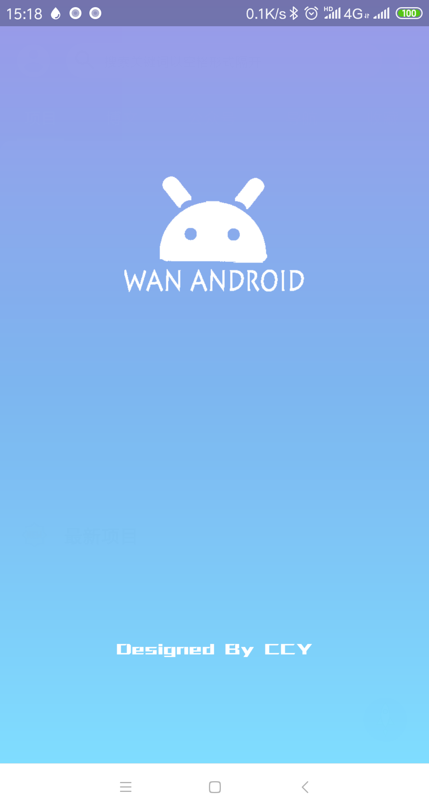 | 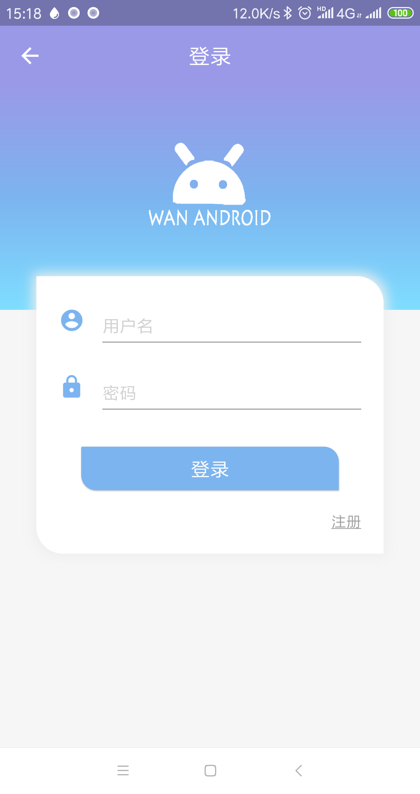 |  |
|:----:|:----:|:----:|
| 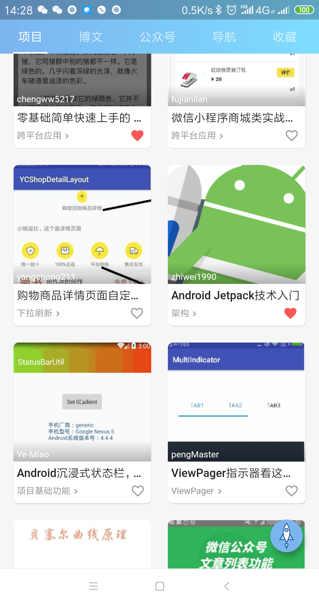 | 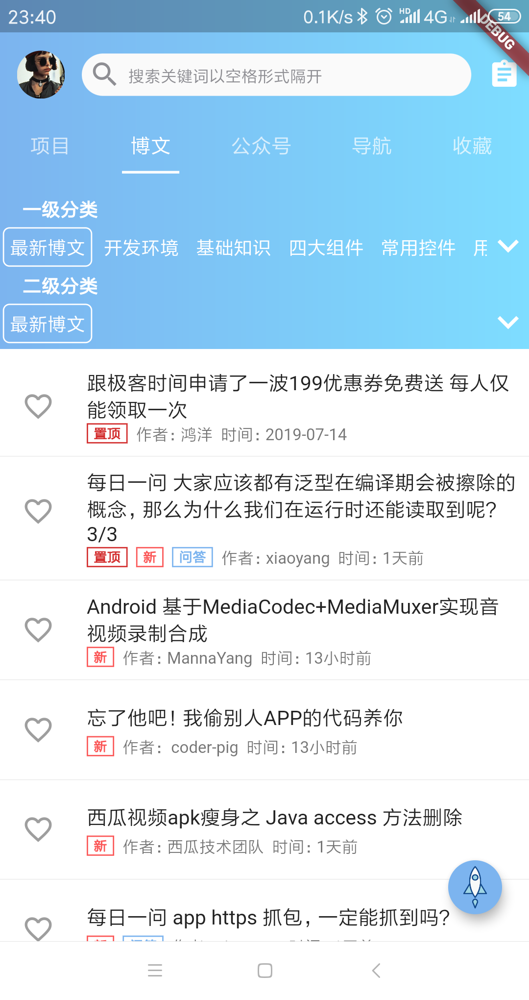 | 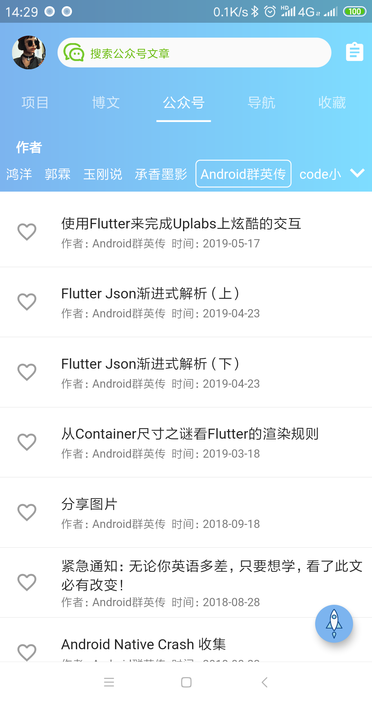 |
| 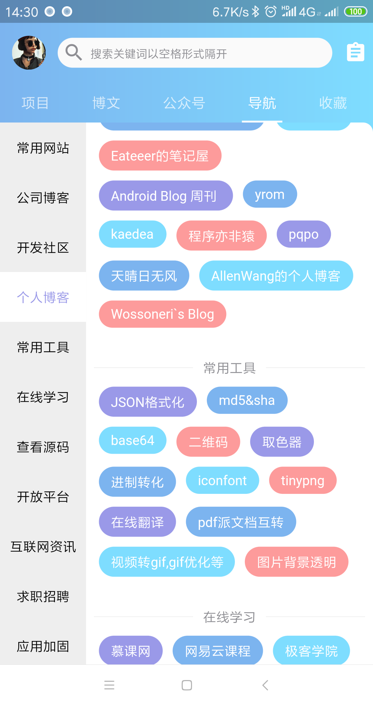 | 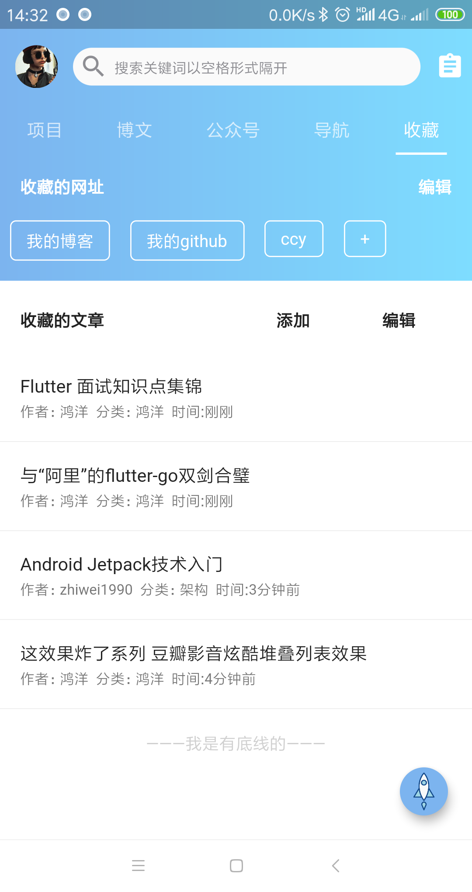 | 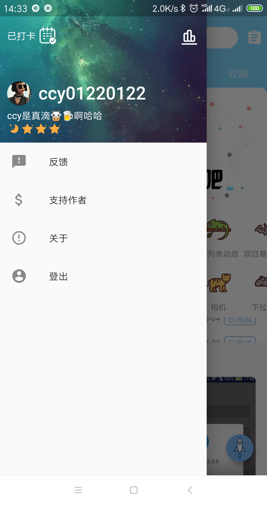 |
|  |  | 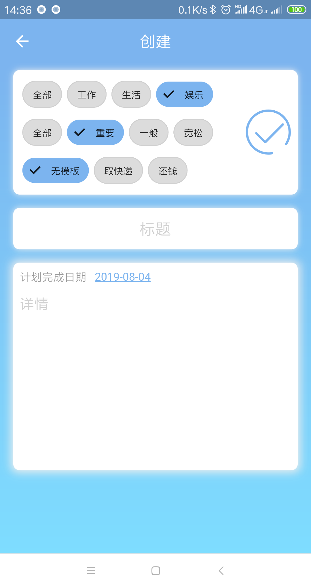 |
| 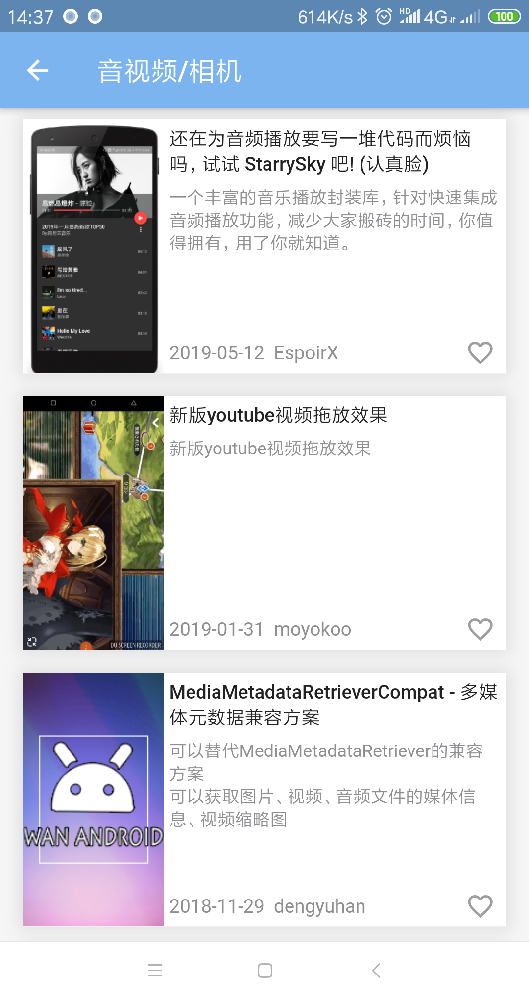 | 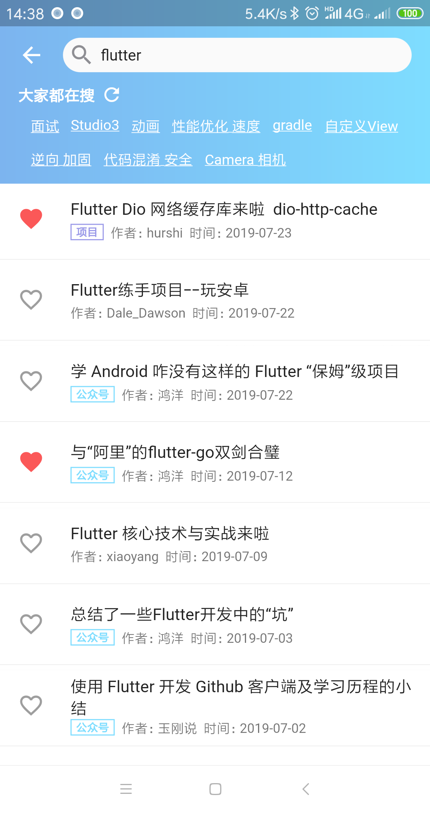 | 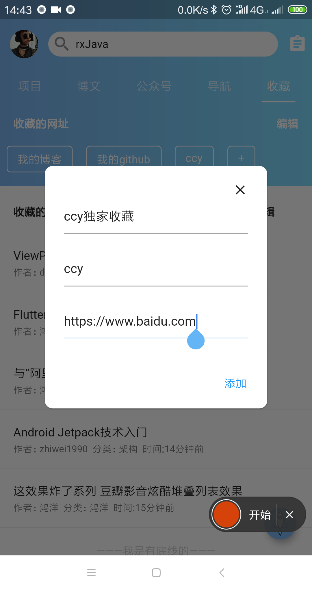 | 

## gif

|  |  | 
|:----:|:----:|
| 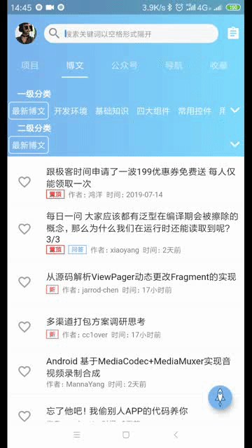 | 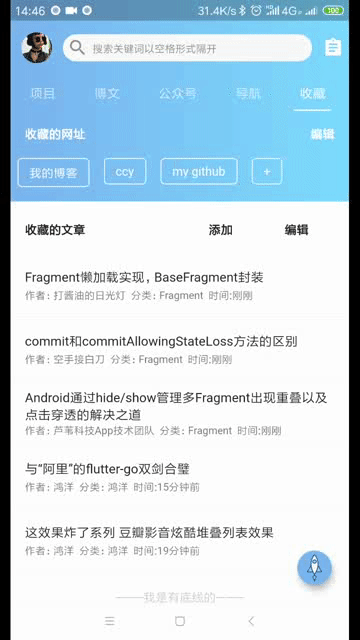 |

## 阿里内推
可帮阿里内推。将想投的阿里招聘官网职位链接+简历简介+备注“github#2”(用于让我知道你是在哪里看到我的)发我邮箱671518768@qq.com。

tips:

1.简历绝对真实，背调阶段查出诚信问题可能会被阿里拉黑。

2.并不是来者不拒，我会做一定把关

3.不建议硬刚，建议做过复习准备

4.可能因为忙回复不及时

## License

        Copyright 2019 CCY0122

    Licensed under the Apache License, Version 2.0 (the "License");
    you may not use this file except in compliance with the License.
    You may obtain a copy of the License at

        http://www.apache.org/licenses/LICENSE-2.0

    Unless required by applicable law or agreed to in writing, software
    distributed under the License is distributed on an "AS IS" BASIS,
    WITHOUT WARRANTIES OR CONDITIONS OF ANY KIND, either express or implied.
    See the License for the specific language governing permissions and
    limitations under the License.
